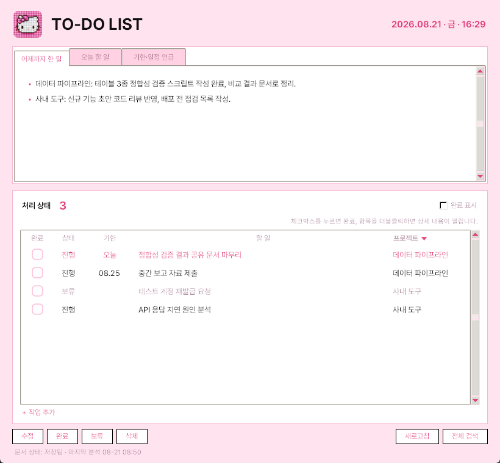

# Work Status

Claude Code 세션 기록을 매일 아침 자동으로 분석하여, "어제까지 한 일 / 오늘 할 일 / 기한"을 할 일 목록으로 정리해주는 Windows용 TO-DO 관리 프로그램입니다.

프로젝트가 방대해지면 "이게 뭐였지, 어디까지 했지"를 찾는 데 시간이 오래 걸립니다. 이 프로그램의 경우 Claude Code로 작업한 대화 기록이 전부 로컬 파일로 남는다는 점을 이용하여, 그 기록을 하루 한 번 AI로 요약해 할 일 목록으로 관리합니다.



> 처음 설치하는 경우 **[INSTALL.md](INSTALL.md)** 를 따라 진행하세요. 제약사항 확인부터 문제 해결까지 순서대로 정리되어 있습니다.

## 1. 동작 구조

```
[매일 아침 08:50 작업 스케줄러]
  collect.py   세션 JSONL → 사람/Claude 대화 텍스트만 추출 (마지막 분석 이후 증분)
      ↓
  analyze.py   claude -p (헤드리스) 1회 호출
               · 어제까지 한 일 요약  · 오늘 할 일  · 기한 문장 추출
      ↓
  latest.txt / tasks.json 저장

[프로그램 실행 시]
  app.py       정리된 내용을 즉시 표시 (탭 3개 + 할 일 체크리스트)
```

- 분석은 사용 중인 Claude 구독 안에서 돌아가며 별도 API 과금이 없습니다.
- 하루 1회 증분 분석이라 사용량 소모는 크지 않습니다. 과거 기록 탐색은 [전체 검색] 버튼을 쓰며, 이 경우 AI를 사용하지 않아 비용이 없습니다.

## 2. 필수 조건

1. Windows 10/11
2. **Claude Code 설치 + 로그인** (필수 — 분석이 이 PC의 Claude 구독으로 실행됩니다)
3. 세션 기록은 Claude Code(VSCode/터미널)를 실제로 사용해야 쌓입니다. claude.ai 웹 대화는 로컬에 저장되지 않아 읽지 못합니다.

## 3. 설치 방법 A — exe 한 개로 (가장 간단)

1. [Releases](../../releases)에서 `WorkStatus.exe`를 받아 원하는 폴더에 복사합니다. (데이터 파일이 exe 옆에 생성되므로 전용 폴더 권장)
2. 실행 후 [새로고침]을 누르면 첫 정리가 생성됩니다. (2~4분 소요)
3. 아침 자동 분석을 원하는 경우 명령 프롬프트에서 아래를 한 번 실행합니다.
   ```
   WorkStatus.exe --install-schedule
   ```
4. 이름 설정: exe 옆에 `config.json` 파일을 만들어 넣으면 분석에 반영됩니다. (`config.example.json` 참고)

주의사항:
- 처음 실행 시 SmartScreen 경고가 뜨면 [추가 정보 → 실행]으로 진행합니다.
- **Smart App Control이 켜진 PC의 경우 서명 없는 exe가 차단될 수 있습니다.** 이 기능은 한 번 끄면 Windows 재설치 전까지 다시 켤 수 없으므로, 끄는 대신 아래 B 방법을 권합니다.

## 4. 설치 방법 B — Python으로 (Smart App Control PC / 개발용)

1. [python.org](https://www.python.org/downloads/)에서 Python 3.13+ 설치 (공식 설치본은 서명되어 있어 차단되지 않습니다)
2. 이 레포를 클론하거나 ZIP으로 받아 폴더에 풉니다.
3. 의존성 설치: `pip install pillow`
4. 실행: `pythonw app.py` (바로가기를 만들 때는 대상: `pythonw.exe "...\app.py"`, 아이콘: `app.ico`)
5. 아침 자동 분석 등록:
   ```
   schtasks /Create /TN WorkStatusDaily /SC DAILY /ST 08:50 /F /TR "\"C:\...\pythonw.exe\" \"C:\...\analyze.py\""
   ```

## 5. 사용법

- **정리 탭**: 어제까지 한 일 / 오늘 할 일 / 기한·일정 언급이 탭으로 나뉩니다.
- **체크박스**: 클릭하면 완료 처리, 다시 클릭하면 해제됩니다.
- **더블클릭**: 항목의 전체 내용(메모·기한)이 팝업으로 열립니다.
- **프로젝트 ▼ 헤더**: 클릭하면 프로젝트별 필터 메뉴가 열립니다.
- **[삭제]**: 확인 후 목록에서 완전히 제거되며, 다음 분석 때 같은 항목이 되살아나지 않도록 내부적으로 차단됩니다.
- **[전체 검색]**: 전체 세션 기록에서 키워드를 찾습니다. (AI 미사용, 무료)
- **inbox 폴더**: 문서를 txt/md로 넣어두면 다음 분석 때 기한·할 일을 추출한 뒤 `inbox/processed/`로 옮겨집니다.
- 세션에 "~까지 이거 해야 됨"이라고 적으면 다음 분석 때 자동으로 할 일에 등록됩니다.

## 6. exe 직접 빌드

```
pip install pillow pyinstaller
python -m PyInstaller --noconfirm --onefile --windowed --icon app.ico --name WorkStatus ^
  --add-data "kitty.png;." --add-data "app.ico;." --add-data "fonts;fonts" app.py
```
`dist/WorkStatus.exe`가 생성됩니다. 빌드 PC에 Smart App Control이 켜져 있으면 방금 만든 exe도 차단될 수 있으니, 실행 확인은 대상 PC에서 하는 것이 정확합니다.

## 7. 제약 사항

- 각 PC는 자기 세션만 읽습니다. PC 간 할 일 목록 통합은 지원하지 않습니다. (tasks.json도 PC별)
- 완료 자동 감지는 대화에 "~완료"가 명시된 경우에만 동작하며, 그 외에는 체크박스로 직접 처리합니다.
- 아이콘·헤더 이미지를 바꾸고 싶은 경우 원하는 이미지를 `kitty_source.jpg`로 저장하고 `make_kitty.py`의 크롭 좌표를 조정해 실행하면 `app.ico`와 `kitty.png`가 재생성됩니다.
- 동봉된 Pretendard 폰트는 SIL OFL 1.1 라이선스입니다. (`fonts/LICENSE`)

---
Built with [Claude Code](https://claude.com/claude-code)
